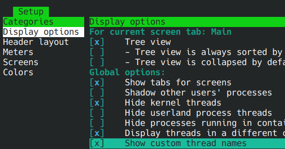
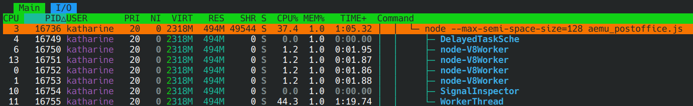

## Index

- [Prerequisite](#prerequisite)
- [Starting server](#starting-server)
- [`config.json` configuration file](#configjson-configuration-file)
- [Performance tuning](#performance-tuning)
- [Viewing server status internally](#viewing-server-status-internally)

### Prerequisite

Clients expects the relay server on TCP port 27313, and HTTP port 27314 is used for internal API calls. You'll have to make sure your clients can reach 27313, and you can internally reach 27314 for future integrations with adhocctl server.

A 10 years old x86_64 xeon with ~500MB of ram just for the program should be enough to serve 500 clients with most games, but keep in mind the requirement flutuates depending on networking condition, and how much traffic specific games send.

### Server software downloading

https://github.com/Kethen/aemu_postoffice/releases

### Starting server

#### Linux/WSL with podman installed:

Terminal:
```
# install podman, ubuntu/debian
apt update; apt install podman

# install podman, Fedora
dnf install podman

# install podman, openSUSE
zypper install podman

# Switch current directory to where you have extracted the release
cd server_njs

# remove nodejs docker image so that it gets updated later, you can skip this if you want
podman image rm node:slim

# fetch newest nodejs docker image if not available and run aemu_postoffice.js through it, with old space set to 500MB and semi space set to 128MB, memory usage should be limited to roughly 628MB
MAX_OLD_SPACE_MB=500 MAX_SEMI_SPACE_MB=128 bash run_podman.sh
```

#### Linux/WSL with node installed from distro or https://nodejs.org/en/download:

Terminal:
```
# Switch current directory to where you have extracted the release
cd server_njs

# run aemu_postoffice.js with old space set to 500MB and semi space set to 128MB, memory usage should be limited to roughly 628MB
node --max-old-space-size=500 --max-semi-space-size=128 aemu_postoffice.js
```

#### Windows with node installed from https://nodejs.org/en/download

cmd:
```
# Switch current directory to where you have extracted the release
cd server_njs

# run aemu_postoffice.js with old space set to 500MB and semi space set to 128MB, memory usage should be limited to roughly 628MB
node --max-old-space-size=500 --max-semi-space-size=128 aemu_postoffice.js
```

### `config.json` configuration file

```
{
	"connection_strict_mode":false,
	"forwarding_strict_mode":false,
	"max_per_second_data_rate_byte":0,
	"max_tx_op_rate":0,
	"accounting_rate_ms":30000,
	"max_write_buffer_byte":512000,
	"max_connections":5000,
	"num_worker_threads":1,
	"tick_rate_hz":90,
	"max_ips":0
}
```

| Name | Description | Reloads on SIGHUP on non Windows platforms |
| -- | -- | -- |
| connection_strict_mode | WIP subjected to changes. Limit new connection to adhocctl clients registered with http://:27314/game_list_sync , sample api json can be found at [sample_game_list_sync_request.json](sample_game_list_sync_request.json) | Yes |
| forwarding_strict_mode | WIP subjected to changes. Limit data transmission within adhocctl client groups registered with http://:27314/game_list_sync , sample api json can be found at [sample_game_list_sync_request.json](sample_game_list_sync_request.json) | Yes |
| max_per_second_data_rate_byte | Evict sessions by IP address that exceeds this data rate (per second). Be cautious with this option as multiple clients can be from the same ip address. Set to 0 to disable. | Yes |
| max_tx_op_rate | Evict sessions by IP address that exceeds send operation rate (per second). Be cautious with this option as multiple clients can be from the same ip address. Set to 0 to disable. | Yes |
| accounting_rate_ms | How often statistics are processed for logging and bad behavior IP sessions eviction. Setting this too low risks extra CPU usage as well as false positives on misbehaving IPs. When deperate for CPU resources, this can be set to 0, however that will disable usage statistics log, as well as the enforcement of max_per_second_data_rate_byte and max_tx_op_rate. | Yes |
| max_write_buffer_byte | Evict sessions that are not receiving data correctly and causing send buffers to bloat. Set to 0 to disable. | Yes |
| max_connections | Global maximum number of connections. Note that this number usually does not match 1 to 1 to number of users, as some games create multiple sockets, hence multiple TCP connections. | No |
| num_worker_threads | Number of worker threads to spawn on top of the main thread. Note that setting this too high will slow the main thread down, as it coordinates work between workers. There should be at least 1 worker thread. | No |
| tick_rate_hz | The server processes packets in bursts. This controls how often the server should process packets. Note that this does not come with any processing timing guarantee, as the actual tick rate depends on whether the server is overloading. Higher tick rate is more CPU demanding, while lower tick rate is more memory demanding. Lower tick rates could also cause lags in some games. 60-120 should be a good range for tuning. | Yes |
| max_ips | Limit the maximum number of unique IPs on the server. When the number is reached, further connections from fresh IPs are rejected. Note that number of unique IPs might not match 1 to 1 to number of users, with NATs on the internet, only adhocctl server carries that data. Set to 0 to disable. | Yes |

By default, the config file is read from `<current directory>/config.json`. `AEMU_POSTOFFICE_CONFIG_PATH` environment variable can be used to change the path.

### Performance tuning

Factors to consider while tuning the server under high load:

- Most of the time the optimal maximum number of workers is (the number of CPU cores you have) - 1.
- If workers are using the CPU way more than the main thread, then it might be time to increase the worker thread count. Go up by one worker and re-test. Workers not getting enough CPU resources will cause memory bloat.
  - If you are already at (the number of CPU cores you have) - 1 workers, and your workers are still not getting enough CPU resources, you'll likely need more cores.
- If main thread is showing a lot of CPU usage, but worker threads are getting very little work, there are two possible cases:
  - You have too many workers, causing overhead.
  - There are a lot of sessions to be handled by the main thread. You'll need a faster CPU core for the main thread, or you should start limiting the amount of unique IPs or connections.
- If your tick rate is too low, it could cause memory bloat, as specific cross thread work are accumulated until tick.
- If you run out of memory without noticing any CPU usage issues, you might have to assign the server more memory on startup, or increase your tick rate.
- If you must serve way too many users with limited hardware, you can set accounting_rate_ms to 0 to save a little bit of CPU and memory. Note that however this will disable usage statistics log, as well as the enforcement of max_per_second_data_rate_byte and max_tx_op_rate.
- Use `--max-old-space-size=` and `--max-semi-space-size=` launch flags to tune memory usage as mentioned above, see also https://nodejs.org/en/learn/diagnostics/memory/understanding-and-tuning-memory#command-line-flags-for-memory-tuning


To inspect thread CPU usage in Linux, install and run `htop`, press F2, under `Display options`, enable `Tree view` and `Show custom thread names`





### Viewing server status internally

Navigate to http://:27314/data_debug to view the current state of the relay server. Note that the data format of this endpoint is not stable.
